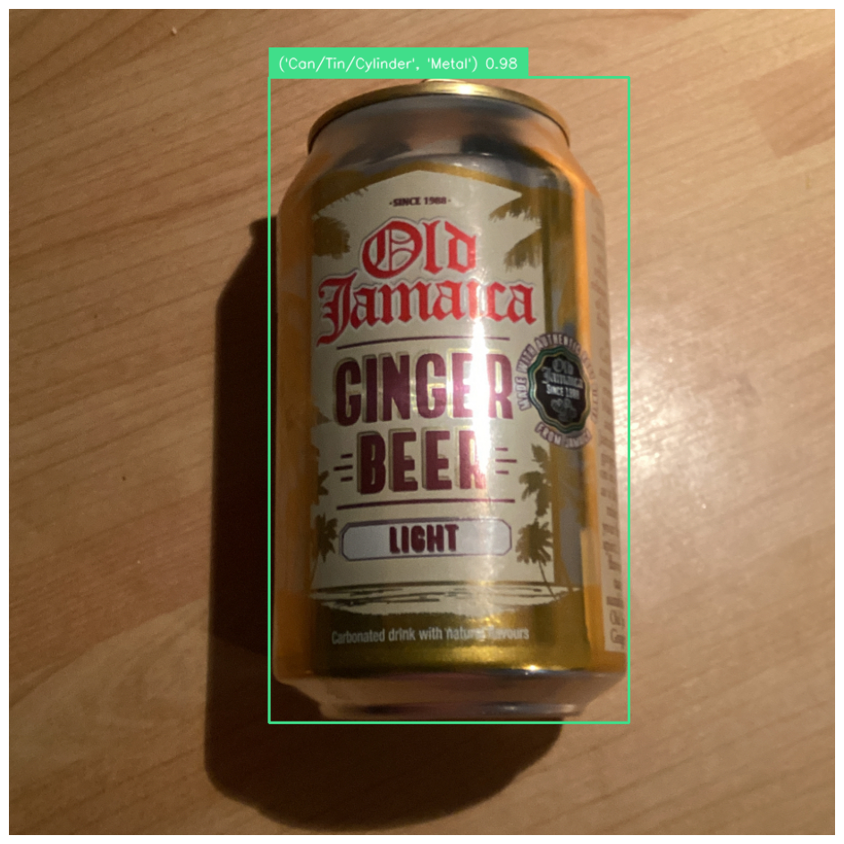

# **Seegull**  

🚧 **TODO: Add Seegull logo here.**

**Seegull** is the library that powers [Bower's](https://getbower.com/) barcodeless scanning functionality. It includes tools for training object detection models, pretrained models, and datasets.

---

## **Installation**

### Prerequisites
Before installing, ensure the following system dependencies are installed:
- `libgl1`
- `libusb-1.0-0-dev`

🚧 **TODO: Publish Seegull to PyPI.**

Once published, you can install Seegull via pip:  
```bash
pip install seegull
```

---

## **Usage**

You can use one of the pretrained models to detect objects and predict their object and material types.

🚧 **TODO: Add Seegull models to Hugging Face and create a downloader for this to work.**

Example usage:
```python
from seegull import Image, YOLOMultiLabel

# Load the pretrained model
model = YOLOMultiLabel("object-material-vX.pt")

# Load an image and make predictions
image = Image(url="...")
image.predict(model).annotate().display()
```

The code above will generate a visual annotation of the detected object and its predicted properties.  

Example output:  


For more comprehensive examples, check out the [notebooks](notebooks) folder.

---

## **Models**

🚧 **TODO: Provide a short description of the released models and links where they can be found.**

This section should include:
- Model names and versions.
- Brief description of each model's purpose and performance.
- Links to download pretrained models.

---

## **Data**

🚧 **TODO: Provide a short description of the released datasets and links where they can be accessed.**

This section should include:
- Dataset descriptions (e.g., contents, sources, licensing).
- Instructions or scripts for downloading the datasets.
- Information on how the datasets were prepared and can be used for training.

---

### **Contributing**

Contributions are welcome! If you have improvements, bug fixes, or new ideas, feel free to open a pull request.

---

By addressing the **TODOs**, this README will become a polished and complete guide for using Seegull.
